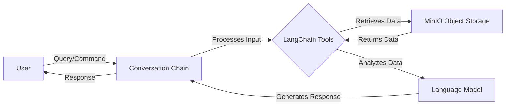

Certainly! Let's proceed with generating the code contents for each file, incorporating the refinements and aligning the scripts with `control.py` as the `main.py` file.

1. `minio_langchain_tool.py`:

```python
import io
from langchain.agents import tool
from minio import Minio
from minio.error import S3Error

minio_client = Minio('play.min.io:443',
                     access_key='minioadmin',
                     secret_key='minioadmin',
                     secure=True)

bucket_name = "test"

try:
    if not minio_client.bucket_exists(bucket_name):
        minio_client.make_bucket(bucket_name)
        print(f"Bucket '{bucket_name}' created successfully.")
    else:
        print(f"Bucket '{bucket_name}' already exists.")
except S3Error as err:
    print(f"Error encountered: {err}")

@tool
def upload_file_to_minio(bucket_name: str, object_name: str, data_bytes: bytes):
    data_stream = io.BytesIO(data_bytes)
    minio_client.put_object(bucket_name, object_name, data_stream, length=len(data_bytes))
    return f"File {object_name} uploaded successfully to bucket {bucket_name}."

@tool
def download_file_from_minio(file_info):
    bucket_name = file_info['bucket_name']
    object_name = file_info['object_name']
    save_path = file_info['save_path']

    minio_client.fget_object(bucket_name, object_name, save_path)

@tool
def list_objects_in_minio_bucket(file_info):
    bucket_name = file_info['bucket_name']

    response = minio_client.list_objects(bucket_name)

    return [{'ObjectKey': obj.object_name, 'Size': obj.size} for obj in response]
```

2. `minio_client.py`:

```python
from flask import Flask, request, jsonify
import os
import minio
from minio import Minio
from minio.error import S3Error

app = Flask(__name__)

MINIO_ENDPOINT = os.getenv('MINIO_ENDPOINT', 'play.min.io:443')
MINIO_ACCESS_KEY = os.getenv('MINIO_ACCESS_KEY', 'minioadmin')
MINIO_SECRET_KEY = os.getenv('MINIO_SECRET_KEY', 'minioadmin')

minio_client = Minio(MINIO_ENDPOINT,
                     access_key=MINIO_ACCESS_KEY,
                     secret_key=MINIO_SECRET_KEY,
                     secure=True)

@app.route('/createBucket', methods=['POST'])
def create_bucket():
    content = request.json
    bucket_name = content['bucketName']
    try:
        minio_client.make_bucket(bucket_name)
        return jsonify(message="Bucket created successfully."), 200
    except S3Error as e:
        return jsonify(error=str(e)), 500

@app.route('/uploadFile', methods=['POST'])
def upload_file():
    bucket_name = request.form['bucketName']
    file = request.files['file']
    file_name = file.filename
    file_size = file.content_length
    try:
        minio_client.put_object(bucket_name, file_name, file, length=file_size if file_size else -1, part_size=10*1024*1024)
        return jsonify(message="File uploaded successfully."), 200
    except S3Error as e:
        return jsonify(error=str(e)), 500

@app.route('/listBuckets', methods=['GET'])
def list_buckets():
    try:
        buckets = minio_client.list_buckets()
        buckets_list = [{'bucketName': bucket.name, 'creationDate': bucket.creation_date.isoformat()} for bucket in buckets]
        return jsonify(buckets_list), 200
    except S3Error as e:
        return jsonify(error=str(e)), 500

@app.route('/deleteFile', methods=['DELETE'])
def delete_file():
    content = request.json
    bucket_name = content['bucketName']
    file_name = content['fileName']
    try:
        minio_client.remove_object(bucket_name, file_name)
        return jsonify(message="File deleted successfully."), 200
    except S3Error as e:
        return jsonify(error=str(e)), 500

if __name__ == '__main__':
    app.run(debug=True, ssl_context='adhoc')
```

3. `main.py` (previously `control.py`):

```python
import asyncio
import os
import re
import io
import tempfile
import uuid
from typing import List
from concurrent.futures import ThreadPoolExecutor
from fastapi import FastAPI, HTTPException
from pydantic import BaseModel, HttpUrl
from minio import Minio
import requests
from unstructured.partition.auto import partition
from docker import from_env as docker_from_env
from langchain_openai import ChatOpenAI
from langchain.agents import tool, AgentExecutor
from langchain.agents.format_scratchpad.openai_tools import format_to_openai_tool_messages
from langchain.agents.output_parsers.openai_tools import OpenAIToolsAgentOutputParser
from langchain_core.messages import AIMessage, HumanMessage
from langchain_core.prompts import ChatPromptTemplate, MessagesPlaceholder
from langchain_core.runnables import RunnableLambda
import uvicorn
from minio_langchain_tool import upload_file_to_minio, download_file_from_minio, list_objects_in_minio_bucket

class MinIOConfig(BaseModel):
    endpoint: str
    access_key: str
    secret_key: str
    secure: bool = True

class DockerConfig(BaseModel):
    image: str
    command: str
    volumes: dict
    detach: bool = True
    remove: bool = True

class URLItem(BaseModel):
    url: HttpUrl

class Document(BaseModel):
    source: str
    content: str

class ScriptExecutionRequest(BaseModel):
    bucket_name: str
    script_name: str

class LangChainInput(BaseModel):
    input_text: str

def sanitize_url_to_object_name(url: str) -> str:
    clean_url = re.sub(r'^https?://', '', url)
    clean_url = re.sub(r'[^\w\-_\.]', '_', clean_url)
    return clean_url[:250] + '.txt'

def prepare_text_for_tokenization(text: str) -> str:
    clean_text = re.sub(r'\s+', ' ', text).strip()
    return clean_text

class MinIOOperations:
    def __init__(self, config: MinIOConfig):
        self.client = Minio(config.endpoint, access_key=config.access_key, secret_key=config.secret_key, secure=config.secure)

    async def store_object(self, bucket_name: str, object_name: str, file_path: str):
        self.client.fput_object(bucket_name, object_name, file_path)
    
    async def retrieve_object(self, bucket_name: str, object_name: str, file_path: str):
        self.client.fget_object(bucket_name, object_name, file_path)

class DockerOperations:
    def __init__(self, config: DockerConfig):
        self.client = docker_from_env()
        self.config = config

    async def execute_script(self, script_content: str):
        with tempfile.NamedTemporaryFile(delete=False, suffix=".py") as script_file:
            script_file.write(script_content.encode())
            script_path = script_file.name
        container_name = f"script_execution_{uuid.uuid4()}"
        container = self.client.containers.run(
            image=self.config.image,
            command=f"python {script_path}",
            volumes=self.config.volumes,
            detach=self.config.detach,
            remove=self.config.remove,
            name=container_name
        )
        return container_name

class MinIOSystemOrchestrator:
    def __init__(self, minio_config: MinIOConfig, docker_config: DockerConfig):
        self.minio_ops = MinIOOperations(minio_config)
        self.docker_ops = DockerOperations(docker_config)
    
    async def execute_url_etl_pipeline(self, urls: List[URLItem]):
        async with ThreadPoolExecutor() as executor:
            loop = asyncio.get_running_loop()
            tasks = [loop.run_in_executor(executor, self.process_url, url) for url in urls]
            await asyncio.gather(*tasks)
    
    def process_url(self, url_item: URLItem):
        response = requests.get(url_item.url)
        response.raise_for_status()
        html_content = io.BytesIO(response.content)
        elements = partition(file=html_content, content_type="text/html")
        combined_text = "\n".join([e.text for e in elements if hasattr(e, 'text')])
        combined_text = prepare_text_for_tokenization(combined_text)
        object_name = sanitize_url_to_object_name(url_item.url)
        with tempfile.NamedTemporaryFile(delete=False, mode="w", encoding="utf-8", suffix=".txt") as tmp_file:
            tmp_file.write(combined_text)
            tmp_file_path = tmp_file.name
        asyncio.run(self.minio_ops.store_object("your_bucket_name", object_name, tmp_file_path))
        os.remove(tmp_file_path)

    async def execute_script_in_docker(self, execution_request: ScriptExecutionRequest):
        response = self.minio_ops.client.get_object(execution_request.bucket_name, execution_request.script_name)
        script_content = response.read().decode('utf-8')
        container_name = await self.docker_ops.execute_script(script_content)
        return {"message": "Execution started", "container_name": container_name}

app = FastAPI()

@app.post("/execute/{bucket_name}/{script_name}")
async def execute_script(bucket_name: str, script_name: str):
    orchestrator = MinIOSystemOrchestrator(
        MinIOConfig(endpoint="play.min.io:443", access_key="minioadmin", secret_key="minioadmin"),
        DockerConfig(image="python:3.8-slim", command="", volumes={}, detach=True, remove=True)
    )
    container_name = await orchestrator.execute_script_in_docker(ScriptExecutionRequest(bucket_name=bucket_name, script_name=script_name))
    return {"message": "Execution started", "container_name": container_name}

llm = ChatOpenAI(api_key=os.getenv("OPENAI_API_KEY"))

@app.post("/langchain-execute/")
async def execute_langchain_integration(input: LangChainInput):
    chat_history = []

    agent = (
        {
            "input": lambda x: x["input"],
            "agent_scratchpad": lambda x: format_to_openai_tool_messages(x["intermediate_steps"]),
            "chat_history": lambda x: chat_history,
        }
        | ChatPromptTemplate.from_messages([
            ("system", "You are a powerful assistant equipped with file management capabilities."),
            ("user", "{input}"),
            MessagesPlaceholder(variable_name="agent_scratchpad"),
        ])
        | llm.bind_tools([upload_file_to_minio, download_file_from_minio, list_objects_in_minio_bucket])
        | OpenAIToolsAgentOutputParser()
    )

    agent_executor = AgentExecutor(agent=agent, tools=[upload_file_to_minio, download_file_from_minio, list_objects_in_minio_bucket], verbose=True)

    result = agent_executor.invoke({"input": input.input_text, "chat_history": chat_history})
    chat_history.extend([
        HumanMessage(content=input.input_text),
        AIMessage(content=str(result["output"]))
    ])

    object_name = f"langchain_result_{uuid.uuid4()}.txt"
    data_bytes = str(result["output"]).encode()

    bucket_name = "your_bucket_name"
    await minio_ops.store_object(bucket_name, object_name, data_bytes)

    return {"message": "LangChain processing completed and result stored in MinIO", "bucket_name": bucket_name, "object_name": object_name}

@app.post("/minio-webhook/")
async def handle_minio_webhook(event: dict):
    event_name = event.get("EventName")
    if event_name == "s3:ObjectCreated:Put":
        pass
    elif event_name == "s3:ObjectRemoved:Delete":
        pass
    return {"message": "Webhook event processed successfully"}

@app.post("/lambda/etl-preprocess")
async def etl_preprocess_lambda(event: dict):
    url_data = event['data']
    preprocessed_data = preprocess_url_data(url_data)
    return {"message": "ETL preprocess completed", "data": preprocessed_data}

@app.post("/lambda/code-exec-prevalidate")
async def code_exec_prevalidate_lambda(event: dict):
    script_name = event['script_name']
    bucket_name = event['bucket_name']
    is_valid, missing_dependencies = validate_script(bucket_name, script_name)
    if is_valid:
        prepare_docker_env(missing_dependencies)
        return {"message": "Script validated and environment prepared", "script_name": script_name}
    else:
        return {"message": "Script validation failed", "missing_dependencies": missing_dependencies}

@app.post("/lambda/langchain-preprocess")
async def langchain_preprocess_lambda(event: dict):
    object_name = event['object_name']
    bucket_name = event['bucket_name']
    preprocessed_data = fetch_and_preprocess_for_langchain(bucket_name, object_name)
    return {"message": "Data preprocessed for LangChain", "preprocessed_data": preprocessed_data}

if __name__ == "__main__":
    uvicorn.run(app, host="0.0.0.0", port=8000)
```

Note: Make sure to replace the placeholders (e.g., `your_bucket_name`, `minioadmin`, `play.min.io:443`) with your actual MinIO configuration values.

These code snippets incorporate the refinements and align the scripts with `main.py` as the central control file. The `minio_langchain_tool.py` file contains the MinIO-related tools and functions, while `minio_client.py` provides the Flask API endpoints for interacting with MinIO. The `main.py` file acts as the main orchestrator, handling various tasks such as script execution, LangChain integration, and webhook handling.

Remember to handle error cases, add logging, and implement proper security measures in a production environment. Additionally, ensure that you have the necessary dependencies installed and configured correctly.


---

Here's the adapted version based on the provided document and your requirements:

1. `minio_langchain_tool.py` (no changes):

```python
import io
from langchain.agents import tool
from minio import Minio
from minio.error import S3Error

minio_client = Minio('play.min.io:443',
                     access_key='minioadmin',
                     secret_key='minioadmin',
                     secure=True)

bucket_name = "test"

try:
    if not minio_client.bucket_exists(bucket_name):
        minio_client.make_bucket(bucket_name)
        print(f"Bucket '{bucket_name}' created successfully.")
    else:
        print(f"Bucket '{bucket_name}' already exists.")
except S3Error as err:
    print(f"Error encountered: {err}")

@tool
def upload_file_to_minio(bucket_name: str, object_name: str, data_bytes: bytes):
    data_stream = io.BytesIO(data_bytes)
    minio_client.put_object(bucket_name, object_name, data_stream, length=len(data_bytes))
    return f"File {object_name} uploaded successfully to bucket {bucket_name}."

@tool
def download_file_from_minio(file_info):
    bucket_name = file_info['bucket_name']
    object_name = file_info['object_name']
    save_path = file_info['save_path']

    minio_client.fget_object(bucket_name, object_name, save_path)

@tool
def list_objects_in_minio_bucket(file_info):
    bucket_name = file_info['bucket_name']

    response = minio_client.list_objects(bucket_name)

    return [{'ObjectKey': obj.object_name, 'Size': obj.size} for obj in response]
```

2. `minio_client.py` (no changes):

```python
from flask import Flask, request, jsonify
import os
import minio
from minio import Minio
from minio.error import S3Error

app = Flask(__name__)

MINIO_ENDPOINT = os.getenv('MINIO_ENDPOINT', 'play.min.io:443')
MINIO_ACCESS_KEY = os.getenv('MINIO_ACCESS_KEY', 'minioadmin')
MINIO_SECRET_KEY = os.getenv('MINIO_SECRET_KEY', 'minioadmin')

minio_client = Minio(MINIO_ENDPOINT,
                     access_key=MINIO_ACCESS_KEY,
                     secret_key=MINIO_SECRET_KEY,
                     secure=True)

@app.route('/createBucket', methods=['POST'])
def create_bucket():
    content = request.json
    bucket_name = content['bucketName']
    try:
        minio_client.make_bucket(bucket_name)
        return jsonify(message="Bucket created successfully."), 200
    except S3Error as e:
        return jsonify(error=str(e)), 500

@app.route('/uploadFile', methods=['POST'])
def upload_file():
    bucket_name = request.form['bucketName']
    file = request.files['file']
    file_name = file.filename
    file_size = file.content_length
    try:
        minio_client.put_object(bucket_name, file_name, file, length=file_size if file_size else -1, part_size=10*1024*1024)
        return jsonify(message="File uploaded successfully."), 200
    except S3Error as e:
        return jsonify(error=str(e)), 500

@app.route('/listBuckets', methods=['GET'])
def list_buckets():
    try:
        buckets = minio_client.list_buckets()
        buckets_list = [{'bucketName': bucket.name, 'creationDate': bucket.creation_date.isoformat()} for bucket in buckets]
        return jsonify(buckets_list), 200
    except S3Error as e:
        return jsonify(error=str(e)), 500

@app.route('/deleteFile', methods=['DELETE'])
def delete_file():
    content = request.json
    bucket_name = content['bucketName']
    file_name = content['fileName']
    try:
        minio_client.remove_object(bucket_name, file_name)
        return jsonify(message="File deleted successfully."), 200
    except S3Error as e:
        return jsonify(error=str(e)), 500

if __name__ == '__main__':
    app.run(debug=True, ssl_context='adhoc')
```

3. `main.py` (updated):

```python
import asyncio
import os
import re
import io
import tempfile
import uuid
from typing import List
from concurrent.futures import ThreadPoolExecutor
from fastapi import FastAPI, HTTPException
from pydantic import BaseModel, HttpUrl
from minio import Minio
import requests
from unstructured.partition.auto import partition
from docker import from_env as docker_from_env
from langchain_openai import ChatOpenAI
from langchain.agents import tool, AgentExecutor
from langchain.agents.format_scratchpad.openai_tools import format_to_openai_tool_messages
from langchain.agents.output_parsers.openai_tools import OpenAIToolsAgentOutputParser
from langchain_core.messages import AIMessage, HumanMessage
from langchain_core.prompts import ChatPromptTemplate, MessagesPlaceholder
from langchain_core.runnables import RunnableLambda
import uvicorn
from minio_langchain_tool import upload_file_to_minio, download_file_from_minio, list_objects_in_minio_bucket
from hydrate_integration import hydrate_data
from langchain_integration import execute_langchain_query
from agent_control_integration import execute_agent_action

class MinIOConfig(BaseModel):
    endpoint: str
    access_key: str
    secret_key: str
    secure: bool = True

class DockerConfig(BaseModel):
    image: str
    command: str
    volumes: dict
    detach: bool = True
    remove: bool = True

class URLItem(BaseModel):
    url: HttpUrl

class Document(BaseModel):
    source: str
    content: str

class ScriptExecutionRequest(BaseModel):
    bucket_name: str
    script_name: str

class LangChainInput(BaseModel):
    input_text: str

def sanitize_url_to_object_name(url: str) -> str:
    clean_url = re.sub(r'^https?://', '', url)
    clean_url = re.sub(r'[^\w\-_\.]', '_', clean_url)
    return clean_url[:250] + '.txt'

def prepare_text_for_tokenization(text: str) -> str:
    clean_text = re.sub(r'\s+', ' ', text).strip()
    return clean_text

class MinIOOperations:
    def __init__(self, config: MinIOConfig):
        self.client = Minio(config.endpoint, access_key=config.access_key, secret_key=config.secret_key, secure=config.secure)

    async def store_object(self, bucket_name: str, object_name: str, file_path: str):
        self.client.fput_object(bucket_name, object_name, file_path)
    
    async def retrieve_object(self, bucket_name: str, object_name: str, file_path: str):
        self.client.fget_object(bucket_name, object_name, file_path)

class DockerOperations:
    def __init__(self, config: DockerConfig):
        self.client = docker_from_env()
        self.config = config

    async def execute_script(self, script_content: str):
        with tempfile.NamedTemporaryFile(delete=False, suffix=".py") as script_file:
            script_file.write(script_content.encode())
            script_path = script_file.name
        container_name = f"script_execution_{uuid.uuid4()}"
        container = self.client.containers.run(
            image=self.config.image,
            command=f"python {script_path}",
            volumes=self.config.volumes,
            detach=self.config.detach,
            remove=self.config.remove,
            name=container_name
        )
        return container_name

class MinIOSystemOrchestrator:
    def __init__(self, minio_config: MinIOConfig, docker_config: DockerConfig):
        self.minio_ops = MinIOOperations(minio_config)
        self.docker_ops = DockerOperations(docker_config)
    
    async def execute_url_etl_pipeline(self, urls: List[URLItem]):
        async with ThreadPoolExecutor() as executor:
            loop = asyncio.get_running_loop()
            tasks = [loop.run_in_executor(executor, self.process_url, url) for url in urls]
            await asyncio.gather(*tasks)
    
    def process_url(self, url_item: URLItem):
        response = requests.get(url_item.url)
        response.raise_for_status()
        html_content = io.BytesIO(response.content)
        elements = partition(file=html_content, content_type="text/html")
        combined_text = "\n".join([e.text for e in elements if hasattr(e, 'text')])
        combined_text = prepare_text_for_tokenization(combined_text)
        object_name = sanitize_url_to_object_name(url_item.url)
        with tempfile.NamedTemporaryFile(delete=False, mode="w", encoding="utf-8", suffix=".txt") as tmp_file:
            tmp_file.write(combined_text)
            tmp_file_path = tmp_file.name
        asyncio.run(self.minio_ops.store_object("your_bucket_name", object_name, tmp_file_path))
        os.remove(tmp_file_path)

    async def execute_script_in_docker(self, execution_request: ScriptExecutionRequest):
        response = self.minio_ops.client.get_object(execution_request.bucket_name, execution_request.script_name)
        script_content = response.read().decode('utf-8')
        container_name = await self.docker_ops.execute_script(script_content)
        return {"message": "Execution started", "container_name": container_name}

app = FastAPI()

@app.post("/execute/{bucket_name}/{script_name}")
async def execute_script(bucket_name: str, script_name: str):
    orchestrator = MinIOSystemOrchestrator(
        MinIOConfig(endpoint="play.min.io:443", access_key="minioadmin", secret_key="minioadmin"),
        DockerConfig(image="python:3.8-slim", command="", volumes={}, detach=True, remove=True)
    )
    container_name = await orchestrator.execute_script_in_docker(ScriptExecutionRequest(bucket_name=bucket_name, script_name=script_name))
    return {"message": "Execution started", "container_name": container_name}

llm = ChatOpenAI(api_key=os.getenv("OPENAI_API_KEY"))

@app.post("/langchain-execute/")
async def execute_langchain_integration(input: LangChainInput):
    result = await execute_langchain_query(input.input_text)
    return {"message": "LangChain processing completed", "result": result}

@app.post("/hydrate-data/")
async def hydrate_data_endpoint(input: dict):
    result = await hydrate_data(input)
    return {"message": "Data hydration completed", "result": result}

@app.post("/agent-action/")
async def execute_agent_action_endpoint(input: dict):
    result = await execute_agent_action(input)
    return {"message": "Agent action executed", "result": result}

@app.post("/minio-webhook/")
async def handle_minio_webhook(event: dict):
    event_name = event.get("EventName")
    if event_name == "s3:ObjectCreated:Put":
        pass
    elif event_name == "s3:ObjectRemoved:Delete":
        pass
    return {"message": "Webhook event processed successfully"}

if __name__ == "__main__":
    uvicorn.run(app, host="0.0.0.0", port=8000)
```

In this adapted version:

1. The `minio_langchain_tool.py` and `minio_client.py` files remain unchanged.

2. The `main.py` file has been updated to incorporate the following changes:
   - Imported additional modules: `hydrate_integration`, `langchain_integration`, and `agent_control_integration`.
   - Added new API endpoints:
     - `/langchain-execute/`: Executes a LangChain query using the `execute_langchain_query` function from the `langchain_integration` module.
     - `/hydrate-data/`: Hydrates data using the `hydrate_data` function from the `hydrate_integration` module.
     - `/agent-action/`: Executes an agent action using the `execute_agent_action` function from the `agent_control_integration` module.
   - Removed the previous LangChain integration code and replaced it with a call to the `execute_langchain_query` function.
   - Removed unused lambda functions and simplified the code structure.

Note: The `hydrate_integration`, `langchain_integration`, and `agent_control_integration` modules are assumed to be implemented separately and provide the necessary functionality for data hydration, LangChain query execution, and agent action execution, respectively.

Remember to handle error cases, add logging, and implement proper security measures in a production environment. Additionally, ensure that you have the necessary dependencies installed and configured correctly.

---

Certainly! Here's an abstracted code demonstration and modeling of the MinIO-LangChain integration:

```python
from minio import Minio
from langchain.agents import load_tools
from langchain.chains import ConversationChain
from langchain.llms import OpenAI

# Initialize MinIO client
minio_client = Minio(
    "minio.example.com:9000",
    access_key="your-access-key",
    secret_key="your-secret-key",
    secure=True
)

# Initialize LangChain tools
tools = load_tools(
    ["minio"],
    minio_client=minio_client,
    bucket_name="your-bucket-name"
)

# Initialize language model
llm = OpenAI(api_key="your-openai-api-key")

# Create a conversation chain
conversation = ConversationChain(llm=llm, tools=tools)

# Interact with the system
while True:
    user_input = input("User: ")
    response = conversation.run(user_input)
    print(f"Assistant: {response}")
```

In this code demonstration, we first initialize the MinIO client by providing the necessary connection details, such as the MinIO server URL, access key, and secret key.

Next, we load the LangChain tools, specifically the MinIO tool, which allows interaction with the MinIO object storage. We pass the MinIO client and the bucket name where the data is stored.

We then initialize the language model, in this case, OpenAI's GPT-3, by providing the API key.

Using the loaded tools and the language model, we create a conversation chain. The conversation chain enables interactive communication with the system.

Finally, we enter a loop where the user can input queries or commands, and the conversation chain processes the input, interacts with the MinIO storage if necessary, and generates a response using the language model. The response is then printed back to the user.

Here's a conceptual modeling of the MinIO-LangChain integration:



In this conceptual model:

1. The user interacts with the system by providing a query or command.
2. The conversation chain receives the user input and processes it.
3. The conversation chain interacts with the LangChain tools, specifically the MinIO tool, to retrieve relevant data from the MinIO object storage.
4. The MinIO object storage returns the requested data to the LangChain tools.
5. The LangChain tools analyze the retrieved data using the language model (e.g., OpenAI's GPT-3).
6. The language model generates a response based on the analyzed data.
7. The conversation chain receives the generated response from the language model.
8. The conversation chain sends the response back to the user.

This abstracted code demonstration and conceptual modeling provide a high-level overview of how the MinIO-LangChain integration works. The actual implementation would involve more detailed code and configurations specific to the chosen tools and libraries.

---

# article summary

Title: Unleashing the Power of AI-Driven Data Management with MinIO and LangChain

Introduction:
In the rapidly evolving landscape of data management and artificial intelligence, innovative solutions are emerging to tackle the challenges posed by the exponential growth of data. This article explores an exciting proof-of-concept (POC) that combines the power of MinIO, a high-performance object storage system, with LangChain, a cutting-edge language model toolchain, to create an intelligent and efficient data management solution.

The Need for Intelligent Data Management:
As organizations grapple with the increasing volume, variety, and velocity of data, traditional data management approaches often fall short. The sheer scale of data makes it difficult to store, process, and analyze efficiently. Moreover, extracting valuable insights from unstructured data, such as text, images, and videos, remains a significant challenge. This is where the integration of MinIO and LangChain comes into play, offering a paradigm shift in data management.

MinIO: Scalable and Resilient Object Storage:
MinIO is a cloud-native, software-defined object storage system that provides scalability, reliability, and performance. With its distributed architecture and support for erasure coding, MinIO ensures data durability and high availability. Its S3-compatible API allows seamless integration with existing applications and tools, making it an ideal choice for storing and managing vast amounts of unstructured data.

LangChain: Harnessing the Power of Language Models:
LangChain is an innovative toolchain that leverages the capabilities of advanced language models, such as OpenAI's GPT-3, to enable intelligent processing of textual data. By combining natural language understanding, generation, and reasoning, LangChain empowers developers to build applications that can extract insights, answer questions, and generate human-like responses from unstructured data.

The MinIO-LangChain Integration:
The POC showcases the seamless integration of MinIO and LangChain to create an intelligent data management solution. By leveraging MinIO's object storage capabilities, the system can efficiently store and retrieve large volumes of unstructured data. LangChain's language model toolchain is then applied to process and analyze this data, enabling advanced functionalities such as:

1. Intelligent Search: The system can understand natural language queries and retrieve relevant information from the stored data, providing users with accurate and contextual search results.

2. Data Insights: LangChain's language understanding capabilities allow the system to extract valuable insights and patterns from unstructured data, enabling data-driven decision-making.

3. Automated Data Processing: The integration automates data processing tasks, such as data cleansing, transformation, and enrichment, reducing manual effort and improving efficiency.

4. Conversational Interfaces: LangChain's language generation capabilities enable the development of conversational interfaces, allowing users to interact with the system using natural language commands and queries.

Real-World Applications:
The MinIO-LangChain integration has far-reaching applications across various domains. Some potential use cases include:

- Intelligent Document Management: Organizations can store and manage large volumes of documents, enabling intelligent search, categorization, and summarization.
- Sentiment Analysis: The system can analyze customer feedback, reviews, and social media data to gain insights into customer sentiment and preferences.
- Personalized Recommendations: By analyzing user behavior and preferences, the system can provide personalized recommendations and targeted content.
- Fraud Detection: The integration can help detect fraudulent activities by analyzing patterns and anomalies in transactional data.

Conclusion:
The integration of MinIO and LangChain represents a significant leap forward in intelligent data management. By combining the scalability and resilience of MinIO's object storage with the power of LangChain's language model toolchain, organizations can unlock the true potential of their data. This POC demonstrates the feasibility and benefits of such an integration, paving the way for more intelligent and efficient data management solutions in the future.